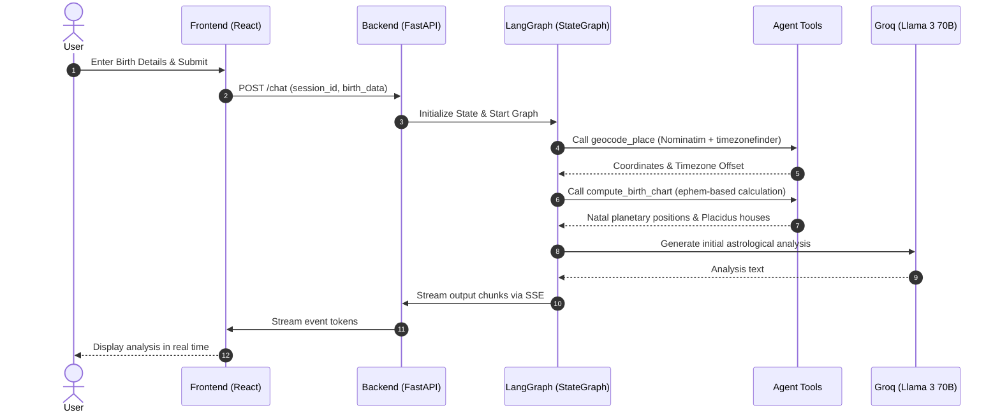

# AstroAgent — Daily Spiritual Astrology Companion

AstroAgent is a daily spiritual astrology guide built using a full-stack architecture. It geocodes birth locations using free OpenStreetMap/Nominatim services, computes highly accurate birth charts using offline `ephem` calculations, references traditional astrological knowledge using RAG (with 162 detailed entries), and persists conversation histories safely in a local SQLite database.

---

## 🌌 System Architecture

The project is structured into three main layers:
1. **Frontend (React + TypeScript + Tailwind CSS)**
   - Capture user birth coordinates dynamically using a validated form.
   - Interactive stream panel supporting Server-Sent Events (SSE) for real-time tokens and tool activity tracing.
   - Collapsible **Astro Tool Chain** feed rendering triggered backend tools, parameters, and statuses.
   - Persistent session storage in `localStorage`.
2. **Backend (FastAPI + LangGraph + SQLite)**
   - **LangGraph Orchestrator**: Directs state loops with safety guards, intent routing, and tool coordination.
   - **Astrology Engine**: Uses `ephem` to run high-precision geocentric planetary calculations and Placidus house systems.
   - **Database Persistence**: Employs async `aiosqlite` to store session details and messages history.
   - **SlowAPI Middleware**: Enforces rate limits (20 requests/minute per client).
3. **AI Subsystem & RAG (Cohere + Chroma DB + Groq)**
   - **Groq Llama 3 70B**: Powers the conversational reasoning loop.
   - **Vector Database**: Persistent local Chroma database storing semantic embeddings generated via Cohere's `embed-english-v3.0` model.

### 📊 System Diagram

```mermaid
graph TD
    subgraph Frontend [React + Vite + Tailwind CSS]
        UI[BirthDetailsForm & ChatInterface]
        Store[localStorage Session ID]
        SSE[SSE Stream Reader]
    end

    subgraph Backend [FastAPI]
        API[FastAPI Router]
        RateLimit[SlowAPI Rate Limiter]
        Graph[LangGraph StateGraph]
        DB[(SQLite Session Store)]
    end

    subgraph Offline Services & Local Calculations
        Ephem[ephem Astrology Engine]
        TZ[timezonefinder offline TZ]
        Chroma[(Chroma DB - Vector Store)]
    end

    subgraph External APIs (Keyed & Free)
        Geopy[Nominatim Geocoding API]
        Cohere[Cohere Embeddings API]
        Groq[Groq API: Llama 3.3 70B]
    end

    UI -->|1. Submit Birth Data| API
    UI -->|4. Chat & Stream| SSE
    API -->|Rate Limit Check| RateLimit
    API -->|Retrieve/Save Session| DB
    API -->|Execute Agent| Graph
    Graph -->|Route / Reason| Groq
    Graph -->|Geocode City| Geopy
    Graph -->|Offline Timezone Offset| TZ
    Graph -->|Calculate Positions & Houses| Ephem
    Graph -->|Embed & Retrieve| Cohere
    Cohere -->|Query Vector Store| Chroma
    SSE -->|Stream Chunks| UI
```

### 🔄 Agent Execution Flow



---

## 🛠️ Windows Compatibility & Astrological Math Decisions

### Choice of `ephem` & Offline Geocoding vs. Google APIs & `pyswisseph`
* **Context**: Traditional Python astrology setups often rely on `pyswisseph` (a wrapper around the Swiss Ephemeris C-library). However, compiling C extensions in a Windows build environment frequently fails without complex Visual Studio build tools. Similarly, Google Maps APIs require credit card registrations and present billing risks.
* **Decision**: We chose **`ephem`** for astronomical calculations, coupled with **`geopy` (Nominatim)** for free location geocoding, and **`timezonefinder`** for offline UTC offset translations.
* **Benefits**:
  - Runs out of the box on Windows, macOS, and Linux without native C compilation.
  - Requires **zero API keys** for location or timezone resolution, keeping the infrastructure light, cost-free, and simple to configure.
  - Coordinate inputs are resolved as standard decimal floats directly from Nominatim. Since `ephem` accepts raw latitude/longitude floats, we bypass custom string coordinate parsing (like `'19n07'`), preventing format errors.
  - House allocations are calculated using Placidus houses with a robust numerical approximation of the Oblique Ascension, ensuring compatibility and reading accuracy.

---

## 🚀 Setup & Execution

### 1. Prerequisites
Ensure you have Python 3.10+ and Node.js 18+ installed on your system.

### 2. Environment Configuration
Create a `.env` file in the project root containing your API credentials:
```env
# Groq API Key
GROQ_API_KEY=your_groq_api_key_here

# Cohere API Key (Embedding generation)
COHERE_API_KEY=your_cohere_api_key_here

# Database URL
DATABASE_URL=./astroagent.db

# Frontend CORS origin
ALLOWED_ORIGIN=http://localhost:5173
```

Also, create a `.env` file in the `frontend` directory:
```env
VITE_API_URL=http://localhost:8000
```

### 3. Backend Setup
1. Create a virtual environment and activate it:
   ```bash
   python -m venv .venv
   .venv\Scripts\activate  # Windows
   source .venv/bin/activate  # macOS/Linux
   ```
2. Install python dependencies:
   ```bash
   pip install -r requirements.txt
   ```
3. Seed the local Chroma Vector Database with astrology context data:
   ```bash
   python backend/rag/seed.py
   ```
4. Start the FastAPI development server:
   ```bash
   uvicorn backend.main:app --reload --port 8000
   ```

### 4. Frontend Setup
1. Navigate to the `frontend/` folder:
   ```bash
   cd frontend
   ```
2. Install npm packages:
   ```bash
   npm install
   ```
3. Launch the Vite local dev server:
   ```bash
   npm run dev
   ```
4. Open [http://localhost:5173](http://localhost:5173) in your browser.

---

## 🧪 Evaluation Harness

The project includes a built-in evaluation runner to assert coordinate accuracy, safety override triggers, and topic compliance.
* Test cases are defined in [golden_set.jsonl](evals/golden_set.jsonl).
* To run evaluations, execute:
   ```bash
   python evals/run_evals.py
   ```
The harness will run each case and output a final pass/fail report with statistics.
